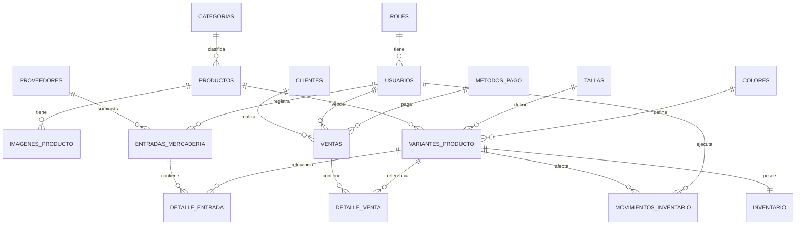

# Base de datos — Tienda de Ropa (tienda_ropa_db)

Diseño relacional en MySQL 8+ para un sistema de catálogo + administración de
inventario y ventas (shorts, pantalonetas, trajes de baño, ropa de playa,
camisas, accesorios), pensado para integrarse con Spring Boot + Spring Data
JPA + Hibernate + Thymeleaf.

Núcleo del diseño: **Producto → Variante (Talla+Color) → Inventario →
Entrada/Venta → Movimiento de inventario (Kardex)**.

---

## 1. Análisis del modelo

Puntos de partida del diseño:

- **El stock nunca vive en `productos`.** Un producto es un concepto general
  ("Short Tropical"); lo que tiene existencias es la combinación
  talla + color, es decir la **variante**. Esto evita el error típico de
  manejar un solo número de stock por producto cuando en realidad hay
  docenas de combinaciones.
- **Cada variante tiene exactamente un registro de inventario** (relación
  1:1), con `stock_actual` y `stock_minimo` propios.
- **Todo cambio de stock pasa por `movimientos_inventario` (Kardex).**
  Ninguna tabla de negocio (ventas, entradas) modifica el stock "directamente"
  desde la perspectiva del modelo: conceptualmente, cada operación que toca
  el stock genera también una fila en el Kardex, de modo que el historial
  siempre pueda reconstruirse y auditarse.
- **Nada históricamente relevante se borra físicamente.** Productos,
  categorías, clientes, proveedores y usuarios usan `estado` (ACTIVO/INACTIVO)
  en vez de `DELETE`. Ventas y entradas nunca se eliminan; a lo sumo se
  anulan con un estado.
- **El dinero siempre es `DECIMAL`**, nunca `FLOAT`/`DOUBLE`, para evitar
  errores de redondeo en precios y totales.
- **La integridad se refuerza con constraints de base de datos** (`CHECK`,
  `UNIQUE`, `FOREIGN KEY`) además de las validaciones que hará la aplicación,
  porque la base de datos es la última línea de defensa contra datos
  inconsistentes.

---

## 2. Diagrama entidad-relación (Mermaid)



Vista simplificada del núcleo del sistema:

```text
Categoria 1---N Producto 1---N VarianteProducto ---(N:1)--- Talla
                                      |         \--(N:1)--- Color
                                      1
                                      |
                                 Inventario

Proveedor 1---N EntradaMercaderia 1---N DetalleEntrada ---N:1--- VarianteProducto
Cliente   1---N Venta             1---N DetalleVenta   ---N:1--- VarianteProducto
VarianteProducto 1---N MovimientoInventario
```

---

## 3. Explicación de las tablas

| Tabla | Rol |
|---|---|
| `roles` | Catálogo fijo de roles (ADMIN, VENDEDOR). |
| `usuarios` | Cuentas del sistema (login administrativo/ventas). |
| `categorias` | Shorts, Pantalonetas, Trajes de baño, Camisas de playa, Accesorios. |
| `tallas` | Catálogo abierto de tallas (XS…XXL, ampliable). |
| `colores` | Catálogo de colores con su código hexadecimal, para pintar swatches en el frontend. |
| `productos` | Ficha general del producto: nombre, SKU, precios, categoría. No tiene stock propio. |
| `imagenes_producto` | Galería de imágenes por producto (rutas, no BLOBs). |
| `variantes_producto` | Combinación única producto+talla+color; es la unidad real de venta/stock. |
| `inventario` | Stock actual y mínimo, 1:1 con cada variante. |
| `proveedores` | Datos de proveedores de mercadería. |
| `entradas_mercaderia` | Cabecera de cada ingreso de mercadería (una por evento de compra). |
| `detalle_entrada` | Líneas de cada entrada: qué variante, cuánta cantidad, a qué costo. |
| `clientes` | Clientes registrados + "Consumidor Final" genérico. |
| `metodos_pago` | Efectivo, Tarjeta, Transferencia (ampliable). |
| `ventas` | Cabecera de cada venta. |
| `detalle_venta` | Líneas de cada venta (variante, cantidad, precio). |
| `movimientos_inventario` | Kardex: registro inmutable de cada cambio de stock, con motivo, cantidad y saldo antes/después. |

---

## 4. Relaciones principales

- `productos.categoria_id → categorias.id` (N:1)
- `variantes_producto.producto_id → productos.id` (N:1)
- `variantes_producto.talla_id → tallas.id`, `variantes_producto.color_id → colores.id` (N:1 cada una)
- `inventario.variante_id → variantes_producto.id` (**1:1**, `UNIQUE`)
- `imagenes_producto.producto_id → productos.id` (N:1)
- `entradas_mercaderia.proveedor_id → proveedores.id`, `.usuario_id → usuarios.id` (N:1)
- `detalle_entrada.entrada_id → entradas_mercaderia.id`, `.variante_id → variantes_producto.id` (N:1)
- `ventas.cliente_id → clientes.id`, `.usuario_id → usuarios.id`, `.metodo_pago_id → metodos_pago.id` (N:1)
- `detalle_venta.venta_id → ventas.id`, `.variante_id → variantes_producto.id` (N:1)
- `movimientos_inventario.variante_id → variantes_producto.id`, `.usuario_id → usuarios.id` (N:1)
- `movimientos_inventario.referencia_tipo/referencia_id` → apunta lógicamente a `entradas_mercaderia` o `ventas` según el tipo de movimiento (no es una FK física, porque la tabla de referencia varía; ver sección 5).

---

## 5. Reglas de integridad

1. **Stock nunca negativo:** `CHECK (stock_actual >= 0)` en `inventario`, más la lógica transaccional de la aplicación que valida antes de descontar.
2. **SKU único** en `productos.sku` y en `variantes_producto.sku_variante`.
3. **No duplicar variantes:** `UNIQUE(producto_id, talla_id, color_id)` en `variantes_producto`.
4. **Dinero en `DECIMAL(10,2)` / `DECIMAL(12,2)`**, nunca `FLOAT`.
5. **Cantidades siempre positivas** en `detalle_entrada.cantidad` y `detalle_venta.cantidad` (`CHECK > 0`); el signo del movimiento (entrada vs. salida) se representa en `movimientos_inventario.tipo_movimiento`, no en el número de línea del detalle.
6. **Eliminación lógica:** `productos`, `categorias`, `clientes`, `proveedores`, `usuarios` usan `estado` ENUM/BOOLEAN en vez de `DELETE`. `ventas` y `entradas_mercaderia` usan estado `COMPLETADA/ANULADA` o `ACTIVA/ANULADA`; nunca se borran.
7. **`movimientos_inventario` es de solo inserción** (append-only) desde el punto de vista del modelo: no se actualiza ni se borra, solo se agregan filas nuevas. Esto se refuerza a nivel de aplicación (el `Service` correspondiente es el único que escribe ahí) y opcionalmente revocando `UPDATE`/`DELETE` sobre esa tabla a los usuarios de aplicación que no lo necesiten.
8. **`referencia_tipo` + `referencia_id`** en el Kardex en vez de una FK directa a `ventas` o `entradas_mercaderia`, porque un mismo movimiento puede originarse en distintas tablas según el tipo (`VENTA` → `ventas.id`, `ENTRADA` → `entradas_mercaderia.id`, ajustes → sin documento o uno propio). Es el patrón estándar para "FK polimórfica"; la consistencia se garantiza desde el `Service`, no con una FK física.

---

## 15. Estrategia transaccional (Spring Boot)

Toda operación que toca stock se ejecuta dentro de **una única transacción**
(`@Transactional`) a nivel de `Service`, nunca a nivel de `Controller` ni
repartida en varias llamadas independientes.

**Flujo de una venta:**

```text
@Transactional
1. Cargar cada variante involucrada (con bloqueo, ver sección 16)
2. Validar stock suficiente para cada línea
   -> si falta stock en cualquier línea: lanzar excepción -> ROLLBACK total
3. Crear cabecera Venta
4. Crear cada DetalleVenta
5. Por cada línea:
     stock_posterior = stock_actual - cantidad
     UPDATE inventario SET stock_actual = stock_posterior
     INSERT movimientos_inventario (tipo=VENTA, cantidad=-n, stock_anterior, stock_posterior, referencia)
6. COMMIT
```

Si falla el paso 5 para cualquier línea (por ejemplo, un `CHECK` de la base
de datos rechaza un stock negativo por una condición de carrera), Spring
revierte **toda** la transacción: no queda venta sin detalle, ni stock
descontado sin venta, ni movimiento sin operación asociada. Lo mismo aplica,
en espejo, para `EntradaMercaderia` (crear cabecera + detalle + sumar stock +
Kardex, todo o nada).

---

## 16. Estrategia de concurrencia

Escenario a resolver: dos vendedores intentan vender las últimas unidades de
la misma variante al mismo tiempo.

**Recomendación: bloqueo optimista (`@Version`) como estrategia por
defecto, con la opción de bloqueo pesimista para el punto exacto de
descuento de stock si el negocio crece a mucha concurrencia real.**

- **Optimistic locking (recomendado para este caso de uso):** agregar una
  columna `version` (`BIGINT`, gestionada por Hibernate con `@Version`) a
  `inventario`. Cada `UPDATE` incluye `WHERE id = ? AND version = ?`; si otra
  transacción ya modificó la fila, el `UPDATE` afecta 0 filas, Hibernate
  lanza `OptimisticLockException`, y el `Service` puede reintentar la
  operación releyendo el stock actual o informar al vendedor que el stock
  cambió. Es la opción más simple y con menor costo de bloqueo para un
  sistema de una sola tienda con concurrencia moderada (pocos vendedores
  simultáneos), que es el caso típico aquí.
- **Pessimistic locking (`SELECT ... FOR UPDATE`) como alternativa/reserva:**
  si en el futuro hay picos de alta concurrencia sobre las mismas variantes
  (por ejemplo, una promoción con muchos vendedores compitiendo por el mismo
  producto), se puede usar `@Lock(LockModeType.PESSIMISTIC_WRITE)` en el
  `InventarioRepository` al leer la fila de inventario justo antes de
  descontar stock dentro de la transacción de venta. Esto serializa el
  acceso a esa fila específica y evita la sobreventa sin necesidad de
  reintentos, a costa de mayor tiempo de espera bajo contención.
- En cualquiera de los dos casos, el `CHECK (stock_actual >= 0)` de la base
  de datos actúa como **última red de seguridad**: aunque hubiera un error
  de lógica en la aplicación, MySQL rechaza físicamente cualquier `UPDATE`
  que deje el stock negativo.

Para este proyecto (una tienda, pocos usuarios administrativos concurrentes)
el bloqueo optimista es suficiente y más simple de mantener; el pesimista
queda documentado como plan B si la escala lo justifica.

---

## 17. Correspondencia con entidades JPA

| Tabla MySQL | Entidad JPA | Relaciones clave |
|---|---|---|
| `roles` | `Rol` | `Usuario` → `@ManyToOne` |
| `usuarios` | `Usuario` | `@ManyToOne Rol` |
| `categorias` | `Categoria` | `@OneToMany` hacia `Producto` |
| `tallas` | `Talla` | `@OneToMany` hacia `VarianteProducto` |
| `colores` | `Color` | `@OneToMany` hacia `VarianteProducto` |
| `productos` | `Producto` | `@ManyToOne Categoria`; `@OneToMany ImagenProducto`, `@OneToMany VarianteProducto` |
| `imagenes_producto` | `ImagenProducto` | `@ManyToOne Producto` |
| `variantes_producto` | `VarianteProducto` | `@ManyToOne Producto/Talla/Color`; `@OneToOne Inventario` |
| `inventario` | `Inventario` | `@OneToOne VarianteProducto` + `@Version` para locking optimista |
| `proveedores` | `Proveedor` | `@OneToMany` hacia `EntradaMercaderia` |
| `entradas_mercaderia` | `EntradaMercaderia` | `@ManyToOne Proveedor/Usuario`; `@OneToMany DetalleEntrada` (cascade ALL) |
| `detalle_entrada` | `DetalleEntrada` | `@ManyToOne EntradaMercaderia/VarianteProducto` |
| `clientes` | `Cliente` | `@OneToMany` hacia `Venta` |
| `metodos_pago` | `MetodoPago` | `@OneToMany` hacia `Venta` |
| `ventas` | `Venta` | `@ManyToOne Cliente/Usuario/MetodoPago`; `@OneToMany DetalleVenta` (cascade ALL) |
| `detalle_venta` | `DetalleVenta` | `@ManyToOne Venta/VarianteProducto` |
| `movimientos_inventario` | `MovimientoInventario` | `@ManyToOne VarianteProducto/Usuario` |

Notas de mapeo:

- `inventario` ↔ `variantes_producto` se mapea como `@OneToOne`, con
  `@JoinColumn(name = "variante_id", unique = true)` del lado dueño
  (`Inventario`), reflejando la `UNIQUE` de la base.
- Las colecciones "cabecera → detalle" (`EntradaMercaderia.detalles`,
  `Venta.detalles`) usan `cascade = CascadeType.ALL, orphanRemoval = true`
  porque un detalle no tiene sentido sin su cabecera.
- `MovimientoInventario` **no** expone setters de negocio libres ni se
  edita: se crea una sola vez desde `InventarioService` y no se vuelve a
  tocar (tabla append-only).
- Los `ENUM` de MySQL (`tipo_movimiento`, `estado` de venta/entrada) se
  mapean con `@Enumerated(EnumType.STRING)` para que el valor en la base sea
  legible y no dependa del orden declarado en el `enum` de Java.
